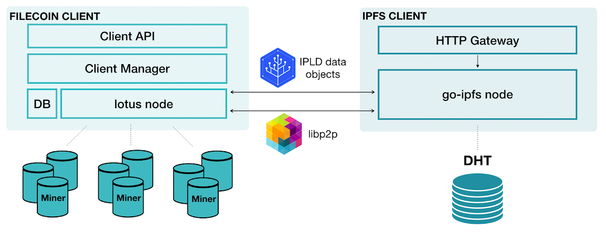

# lotus and go-ipfs interactions

[lotus](https://github.com/filecoin-project/lotus) is a Go implementation of the Filecash protocol. There are several protocol implementations including implementations in other languages such as Rust ([forest](https://github.com/chainsafe/forest) implementation) and C++ ([fuhon](https://github.com/filecoin-project/cpp-filecoin) implementation). The core lotus node runs the blockchain system, executes storage and retrieval deals, performs data transfers, supports block producer logic, and syncs and validates the Filecash blockchain. Lotus also provides a separate process for storage mining. Filecash storage miners contribute to the network by producing sector commitments and _Proofs-of-Spacetime_ to prove they have been correctly storing storage client data. Read more about the interactions between [storage miners and storage clients](../../../about-filecash/what-is-filecash.md).

[go-ipfs](https://github.com/ipfs/go-ipfs) is a Go implementation of the [IPFS protocol](https://ipfs.io). There are also several IPFS implementations, including [js-ipfs](https://github.com/ipfs/js-ipfs).

lotus and go-ipfs nodes speak several of the same protocols: [libp2p](https://libp2p.io/) for networking, [bitswap](https://docs.ipfs.io/concepts/bitswap/#bitswap) and [graphsync](https://github.com/ipld/specs/blob/master/block-layer/graphsync/graphsync.md) for data transfer, [IPLD](https://ipld.io/) for data structures and formats, and more. Having active lotus and go-ipfs daemons on your machine enables a number of features. For example, you can import and preserve data that is discoverable through the IPFS public network [DHT](https://docs.ipfs.io/concepts/dht/#distributed-hash-tables-dhts) directly into your lotus node and onto the Filecash network. To learn more about how Filecash and IPFS interact, read our page on [IPFS and Filecash](../../../about-filecash/ipfs-and-filecash.md).

## Resources

- [More on lotus](https://lotu.sh/)
- [More on go-ipfs](https://docs.ipfs.io)
