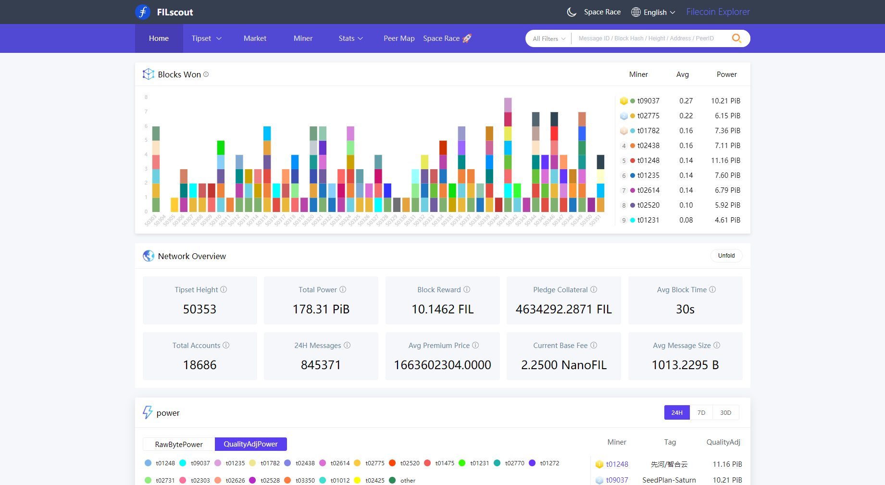

# {{ $frontmatter.title }}

{{ $frontmatter.description }}

[[TOC]]

## Block explorers

| Name                                                 | Screenshot                                                                |
| ---------------------------------------------------- | ------------------------------------------------------------------------- |
| [Filscan](https://filscan.io/)                       |    |
| [Filscout](https://filscout.io/)                     |   |
| [Filfox](https://filfox.io/)                         |     |
| [Filplorer](https://filplorer.com/)                  |  |
| [1475 Explorer](https://1475ipfs.com/#/blockBrowser) |   |

## Lotus

Once you are [setup with Lotus](lotus/README.md) you can use the command line to query information about the nework.

Get the head tipset:

```sh
lotus chain get-head
```

Print a block:

```sh
lotus chain get-block <block_cid>
```

Print message information:

```sh
lotus chain get-message <message_cid>
```

For additional chain-related commands check:

```sh
lotus chain --help
```
